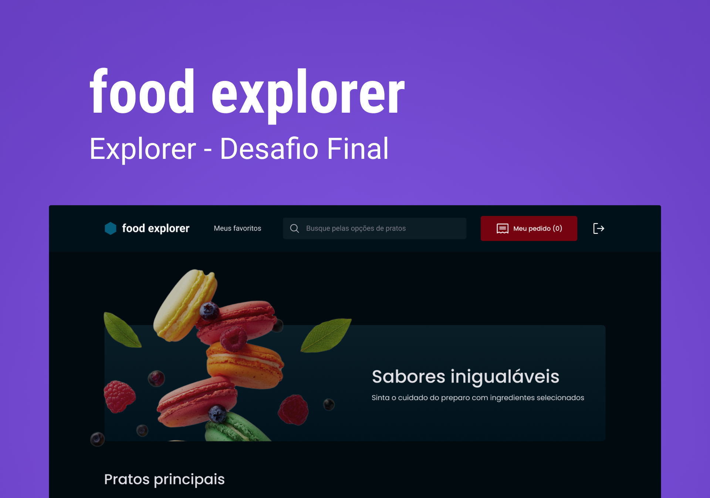
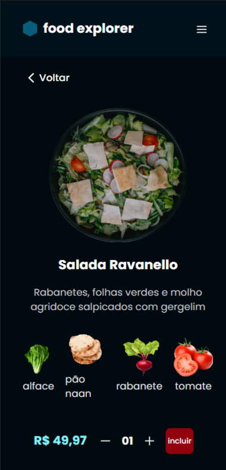
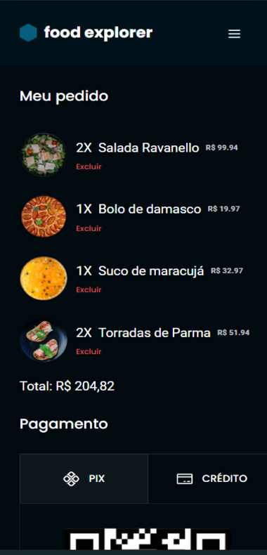

<h1 align="center">
    <a href="#"> Food Explorer </a>
</h1>

<h4 align="center"> 
	 Status: Finished
</h4>

<p align="center">
 <a href="#-about">About</a> •
 <a href="#-Features">Features</a> •
 <a href="#-layout">Layout</a> • 
 <a href="#-tech-stack">Tech Stack</a> • 
 <a href="#-author">Author</a> • 
 <a href="#-license">License</a>

</p>

## 💻 About

The application that we will develop is a digital menu for a fictional restaurant, known as foodExplorer.
In this challenge, the following topics were addressed:

- React;
- Routes;
- components;
- Props;
- hooks;
- context;

---

## ⚙️ Features

- [x] A structured project, with a good organization of folders, division of components in the front-end, etc.
- [x] A README.md file with specifications on how to run the project in a dev environment.
- [x] Users must authenticate themselves to enter the application through the login screen, you can apply what you learned in JWT authentication classes. Authentication must be validated with a password.
- [x] The admin will upload images to register the dishes.
- [x] Finally, deploy your application.
- [x] Give your functions and variables meaningful names: work with Clean Code concepts a bit.
- [x] The admin, restaurant and users data will be stored in a database.
- [x] Possibility to search by dish name, ingredients or favorite dish
- [x] It is essential that your interface consumes its own API.
- [x] Interesting to make the application responsive: use the concept of Mobile First that was learned in class.
- [x] It's up to you where to apply animations, transitions, and transformations.
- [x] It meets the model proposed in Figma and contains elements indicative of action and state.
      opcionais
- [x] The user can add items to the cart by clicking the add button. The amount is controlled by the “-” and “+” buttons;
- [x] By clicking on the my order button, the user will be redirected to a screen where he will see his order, the sum and the payment methods;
- [x] The user will be able to delete a dish from the cart and the total amount of the order should be updated automatically;
- [x] The user can mark a dish as a favorite, just click on the heart that appears next to each one;
- [x] The admin will view and control the status of each order, through a select field. Orders will appear in a table when you click Orders;

---

## 🎨 Layout

### Web

<p align="center" style="display: flex; align-items: flex-start; justify-content: center;">
  

</p>

### Mobile

<p>






</p>

### Deploy

[Food Explorer](https://food-explorer-benhur.netlify.app)

---

## 🚀 How it works

This project is divided into two parts:

1. Backend (food-explorer-backend folder)
2. Frontend (food-explorer-frontend folder)

💡 The Frontend needs the Backend to be running to work.

### Pre-requisites

Before you begin, you will need to have the following tools installed on your machine: [Git] (https://git-scm.com), [Node.js] (https://nodejs.org/en/). In addition, it is good to have an editor to work with the code like [VSCode] (https://code.visualstudio.com/)

#### 🎲 Running the Server (Backend)

```bash
# Clone this repository
$ git clone git@github.com:benhur3010/FoodExplorer-BackEnd.git

# Access the project folder in your terminal
$ cd food-explorer-backend

# Install the dependencies
$ npm install

# run the migration and seed
$ npm migrate

# Run the application in development mode
$ npm run dev

# The Server will start at port: 3333 - go to http://localhost:3333
```

---

#### 🧭 Running the web application (Frontend)

```bash
# Clone this repository
$ git clone git@github.com:benhur3010/FoodExplorer-FrontEnd.git

# Access the project folder in your terminal
$ cd food-explorer-frontend

# Install the dependencies
$ npm install

# Run the application in development mode
$ npm run dev

```

---

## 🛠 Tech Stack

The following tools were used in the construction of the project:

- [React](https://reactjs.org)
- [HTML](https://developer.mozilla.org/pt-BR/docs/Web/HTML)
- [Styled components](https://styled-components.com/)
- [JavaScript](https://developer.mozilla.org/pt-BR/docs/Web/JavaScript)

---

## 💻 **Project**

The application that we will develop is a digital menu for a fictional restaurant, known as foodExplorer.

---

## 📝 License

This project is under the license [MIT](./LICENSE).

Made with ❤️ by Ben-Hur Bueno 👋🏽 [Get in Touch!](www.linkedin.com/in/ben-hur-bueno)

---
